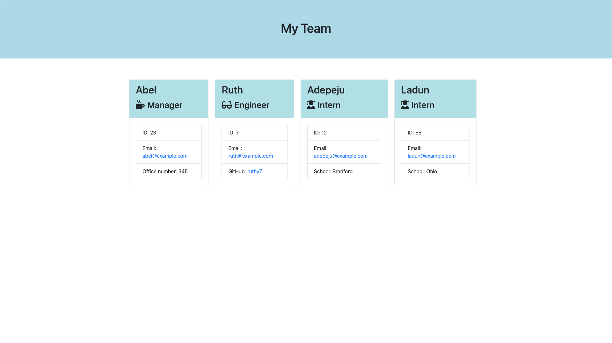

# Team-profile Generator

The aim of this project is to generate a webpage that displays information about a software engineering team from a user's input on the command-line.

## Functionality

The application is started by inputting the following in the command line or terminal:

```
node index.js
```

The user then follows the prompt questions by providing answers to the questions prompted on the command-line. The answers are then used to generate the Team profiles. All prompted questions need to be answered for the application to generate the webpage.

## Installation

For the application to work in your environment, you will need to initialize npm to set-up a package.json file:

```
npm init
```

You will then need to npm install the [Inquirer package](https://www.npmjs.com/package/inquirer#installation), which is used to generate the prompt questions on the command-line.

```
npm install inquirer@^8.0.0
```

Also, you need to install [Jest](https://jestjs.io/docs/getting-started) to test the applications

```
npm install --save-dev jest
```

## Mock-Up

The following image shows the web application's appearance and functionality:

